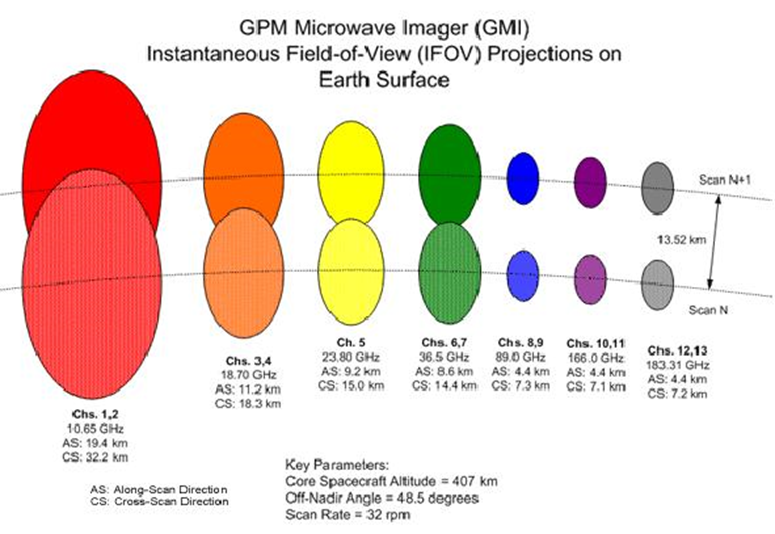
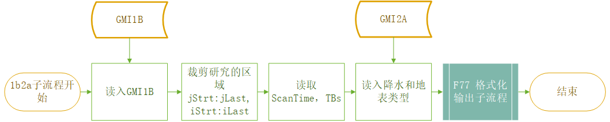
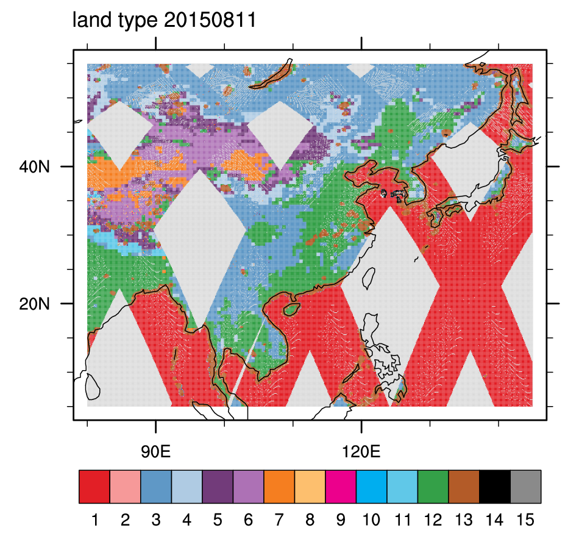
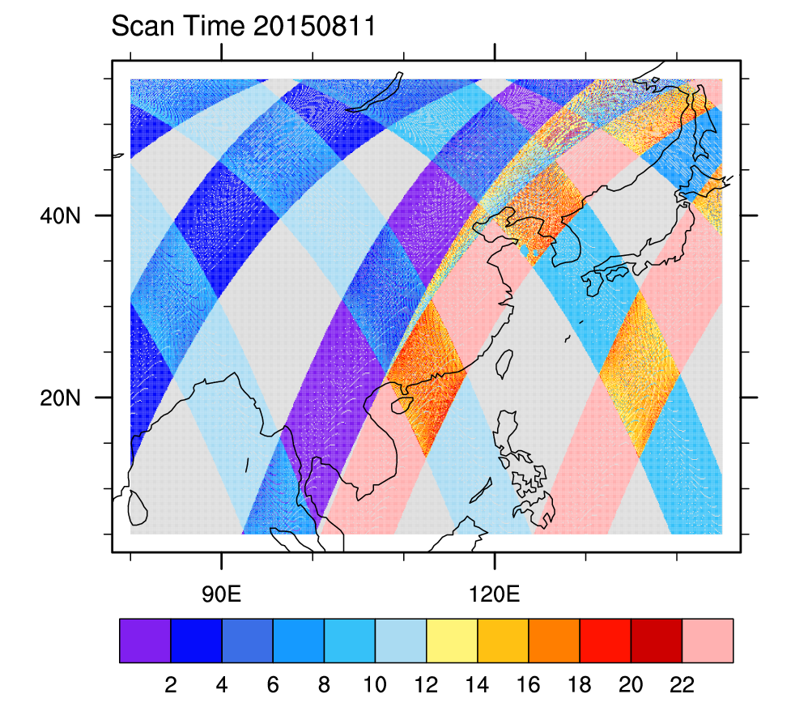
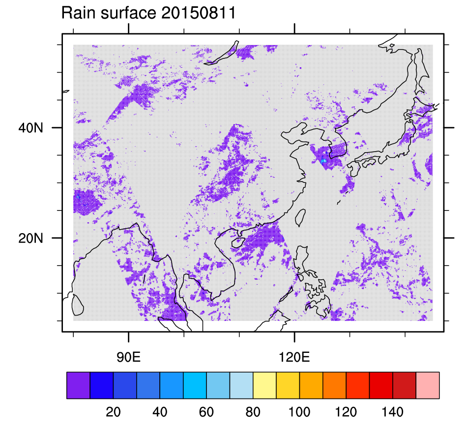

# GMI1B GMI2A处理说明


本部分对GMI1B和GMI2A两个数据集的处理融合操作进行说明。


[[toc]]  

本部分对GMI1B和GMI2A两个数据集的处理融合操作进行说明。

## - 数据介绍

GMI1B数据集是GPM亮温产品，详细信息见[GPM官网](https://pmm.nasa.gov/data-access/downloads/gpm), 以及 [GMI1B  Full Documentation (ATBD)](https://pmm.nasa.gov/sites/default/files/document_files/GPMGMIL1BATBDV4.0.pdf).

GMI2A数据集采用的是 2A-GPROF-GMI，提供单幅轨道的GPROF降水猜测，[GPROF ATBD](https://pmm.nasa.gov/sites/default/files/document_files/ATBD_GPM_GPROF_June1_2017.pdf).

GMI的诸多通道参数如下，重点关注其分辨率大小，这些分辨率都是没有resample的。
ttp:


#### -下载

使用Wget进行下载，脚本如下：

getGMI.sh

```shell
#!/bin/bash
for yymm in `cat $1`; do
    for dd in `cat $2`; do
        dpath=$yymm/$dd'/1B/*GMI*' 
        ##dpath=$yymm/$dd'/gprof/2A.GPM.GMI.GPROF*'  ###下载GMI2A的路径
        echo 'start wget :'$dpath '****************************************************'
        # wget
        wget -c -r -N --ftp-user=hjh18305@gmail.com --ftp-password=hjh18305@gmail.com ftp://arthurhou.pps.eosdis.nasa.gov/gpmdata/$dpath
    done
done
```

说明：只用修改`dpath`的值就可以实现对Gprof数据的下载；串行方式下载，下载比较稳定，支持断点续传；先在[PPS网站 ](http://registration.pps.eosdis.nasa.gov/registration/)上注册用户。

运行方式:

```shell
$sh getGMI.sh yymm day
```

yymm 的内容：指定需要下载的一系列 年/月份

```
2014/03
2014/04
2014/05
······
```

day的内容比较固定，只要列举01~31就行了，不用考虑某些月份不存在31日或29日的情况

```
01 （换行） 02 （换行） 03  （换行） 04 （换行）······  29 （换行） 30 （换行）  31
```

鉴于2014.03~2019.03的数据都已经下载完毕，如果需要最新的数据，可以使用本小节方法下载。

---

##  -处理流程

本部分代码见 `demo/1a2b/`

```shell
-rwxrwxrwx 1 hjh hjh     4980 Aug 20 10:17 1b2a.ncl*     ##主程序
-rwxrwxrwx 1 hjh hjh 97340150 Aug 20 10:18 GMI.1B.2A.20150704.txt*  ##输出示例
-rwxrwxrwx 1 hjh hjh 97190295 Aug 20 10:18 GMI.1B.2A.20150705.txt*  ##输出示例
-rwxrwxrwx 1 hjh hjh     1811 Aug 20 10:18 ascii2d_writeout.f*  ##F77 ncl格式化输出子程序
-rwxrwxrwx 1 hjh hjh    13853 Aug 20 10:18 ascii2d_writeout.so* ##子程序WRAPIT动态库文件
-rwxrwxrwx 1 hjh hjh      290 Aug 20 10:18 batch.sh*   ##批量处理脚本
-rwxrwxrwx 1 hjh hjh     2922 Aug 20 10:22 plot.land.type.ncl*  ##绘制指定日期的landtype
-rwxrwxrwx 1 hjh hjh     2638 Aug 20 10:22 plot.rain.ncl* ##绘制指定日期的降水
-rwxrwxrwx 1 hjh hjh     2604 Aug 20 10:22 plot.stime.ncl* ##绘制指定日期的扫描时间
```

注意，如果修改了`ascii2d_writeout.f`文件，一定要使用

```shell
WRAPT ascii2d_writeout.f
```

更新动态库使其生效.

- 单日处理方式

  ```shell
  $ncl year=2018 month=01 day=01  1b2a.ncl
  ```

- 批量处理方式

  ```shell
  $sh batch.sh 20170101 20170131 
  ```

- 绘制plot

  ```shell
  $ncl year=2018 month=01 day=01  plot.land.type.ncl
  $ncl year=2018 month=01 day=01  plot.rain.ncl
  $ncl year=2018 month=01 day=01  plot.stime.ncl
  ```

  ---

#### -流程



<p style="text-align:center;color:darkred;">图 1.1 1b2a处理流程图</p>


- 本版本使用的land flag数据来自于GMI2A的land type数据，包含15种表面类型。

  ```
  Surface Type Index
  Surface type codes are: 1 : Ocean, 2 : Sea ice, 3-7 : Decreasing vegetation, 
  8-11 :decreasing snow cover, 12: standing water, 13 : land/ocean or water coast, 
  14 : sea-ice edge, 15 = Land/Ice edge
  ```

- 我们融合1B和2A两个数据集的做法是提取研究区域内的观测样本，简单的将各种参数汇总，不做降水和扫描时间以及地表类型的筛选，见本节附录，可以直观地看到诸参数的输出特征。

- 格式化输出结果为

  ```fortran
         write(15,100) ip,isw,lon1d(i),lat1d(i),(tbs1d(i,j),j=1,9),
       +               Time_1D(i),Tyear_1D(i),Tday_1D(i),
       +         	     landflag1d(i),rsurf1d(i)
  		
  100      format(2I6,16F12.6)	
  ```

  | ip             | isw          | lon1d    | lat1d  | tbs1d     |
  | -------------- | ------------ | -------- | ------ | --------- |
  | 单轨上样本编号 | 当日轨道编号 | 经度     | 纬度   | 9通道亮温 |
  | 从0开始        | 0~16/17      | 80E~145E | 5N~55N | K         |
  | I6             | I6           | F12.6    | F12.6  | 9F12.6    |

  | Time_1D  | Tyear_1D  | Tday_1D   | landflag1d | rsurf1d    |
  | -------- | --------- | --------- | ---------- | ---------- |
  | 扫描时间 | 年份      | DayOfYear | 表面类型   | 地表降水率 |
  | UTC (hr) | 2015~2018 | 001~366   | 1~15       | mm/hr      |
  | F12.6    | F12.6     | F12.6     | F12.6      | F12.6      |

  输出示例:

  ```
       1     5  141.161331    5.002299  175.092880   99.461098  208.474106  152.876266  248.847107  226.863785  179.372986  277.821106  266.504150    8.366994 2015.000000  185.000000    1.000000    0.000000
       
       2     5  141.110870    5.010274  175.368225  100.406441  208.396637  152.680099  248.766418  227.576447  179.085526  277.930389  266.942749    8.366994 2015.000000  185.000000    1.000000    0.000000
  ```

  ---

## - 附录

- Land Type 

    

  此分类方法将大片的陆地区域归为standing water（绿色），有待商榷。

  ---

- Scan Time（UTC）

    


  ---

- Surface Rain (mm/h)

    


&copy;Jiheng Hu 2019