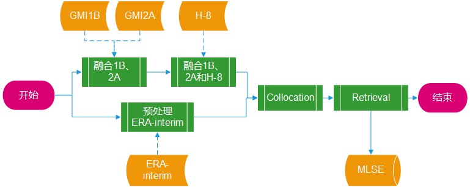
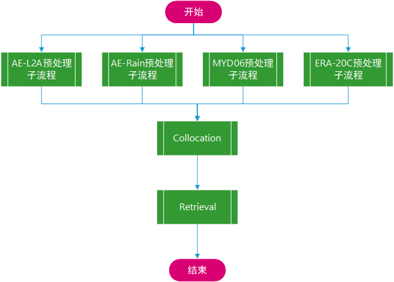

# Microwave Land Surface Emissivity Retrieved from GMI, ERA-Interim and Hamawari-8


使用**GMI**的微波观测结果联合再分析资料和**Hamawari-8**卫星的云参数进行地表微波比辐射的数据库构建，是一系列<abbr title="Microwave Land Surface Emissivity">MLSE</abbr >反演工作的第二版（version 3.0），其重要特征和之前的第二版（version 2.0）的区别在于以下几点：

- **区域**：
  - V3.0 ：**80<sup>o</sup> E ~ 145<sup>o</sup> E ; 5<sup>o</sup> N ~ 55<sup>o</sup> N** 
  - V2.0 ：70<sup>o</sup> E ~ 145<sup>o</sup> E ; 10<sup>o</sup> N ~ 55<sup>o</sup> N 

- **时间**：
  - V3.0 ：**Jul. 4, 2015 ~ Oct. 31, 2018**
  - V2.0 ：Aug. 8, 2002 ~ Dec. 31, 2010

- **Source Datasets**
  - V3.0  : **GMI1B (亮温) |GMI2A（GPROF降水）|ERA-Interim（再分析）|Hamawari-8（云）**
  - V2.0  : AE-L2A(亮温) |AE-Rain（GPROF降水）|ERA-20C（再分析）|MYD06_L2（云）

- **PMW 通道**（单位GHz）：
  - V3.0：**10.65v| 10.65h| 18.7v| 18.7h| 23.8v| 36.5v| 36.5h| 89.0v| 89.0h** 
  - V2.0：6.925v| 6.925h| 10.65v| 10.65h| 18.7v| 18.7h| 23.8v| 23.8h| 36.5v| 36.5h| 89.0v| 89.0h

## - 流程概述

本项目进行数据处理时和v2.0的处理步骤稍微有些不同：在version3.0中，GMI1B，GMI2A和Hamawari-8数据的处理是有先后顺序的，知道Collocation步骤时才将ERA-interim的数据融合在一起。而在之前的version2.0中，所有的数据集都是先进行独立的预处理以后再全部进行Collocation步骤。version3.0的处理流程见图0.1。相对来说，v3的流程设计极大地简化了Collocation步骤的工作量，并且将对数据质量的把控（有效数据的筛选）分布在不同的步骤中。



<p style="text-align:center;color:darkred;">图 0.1 第三版MLSE反演采用的数据处理流程图</p>



<p style="text-align:center;color:darkred;">图 0.2 第二版MLSE反演采用的数据处理流程图</p>

按照流程，可以将工程组织成一下几个目录：

```shell
drwxr-x---+ 3 root root 69632 Jun 26 15:02 1b2a        ## 融合1B、2A目录
drwxr-x---+ 2 root root 90112 Jul  4 12:04 h8          ##融合1B、2A和H-8 目录
drwxr-x---+ 3 root root  4096 Jun 25 10:34 collocate   ##collocate 目录
drwxr-x---+ 2 root root 65536 Jun 24 15:43 erai        ##预处理 ERA-interim目录
drwxr-x---+ 3 root root  4096 Jul  3 11:14 retrieve    ##反演目录
```

以上各个目录对应图0.1中的子流程（绿色单元），对于子流程的处理细节将在以下章节中逐一介绍。

---

## -产品说明

    ip       样本在单条轨道上的序号
    isw      样本所在轨道在当天所有轨道中的序号
    newl     有效大气廓线层数
    yyyymmdd 样本扫描年月日，可能和文件名中的日期不一致（跨天的轨道）
    landflag 样本点的表面类型：
             1 : Ocean, 2 : Sea ice, 3-7 : Decreasing vegetation, 
             8-11 :decreasing snow cover, 12: standing water, 
             13 : land/ocean or water coast, 14 : sea-ice edge, 15 = Land/Ice edge
    
    lon      样本点经度
    lat      样本点纬度
    MLSEs(9) 反演得到的9通道MLSE
    tb(9)    卫星天顶亮温（K）
    tw1      样本点处的云液态水积分（g/m2）
    lst      地表温度（k）
    t2m      2m气温（K）
    stime    样本扫描UTC时间（hr）
    loct     样本扫描地方时间（hr）
---

&copy; Jiheng Hu 2019