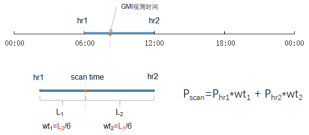
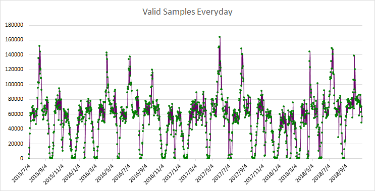

# Collocation 处理说明


[[toc]]  

## 概述  

本节的主要介绍在反演之前对几种数据集1B、2A、H-8和ERAI进行融合的处理细节，而前三种数据在之前的步骤（章节）中已经融合好了。如图0.1介绍的，collocation部分的任务相比前一版本的数据collocation部分要简单很多，只涉及到将era-interim的数据融合进来。处理时我们关心的细节有以下几点：

- 如何定位ERA-interim的文件？
- 如何进行廓线平均，空间上，时间上？
- 如何对云相态进行分类处理，进而计算云水含量？
- 如何定位云在廓线中的位置？
- 以何种形式输出大量的数据（廓线数据较大）？

### 文件描述：

```shell
-rwxrwxrwx 1 hjh hjh 10563 Aug 22 10:55 1b.2a.h8.erai.collocation.f*  ###主程序
-rwxrwxrwx 1 hjh hjh   313 Aug 22 10:25 batch.sh*   ## 批量处理脚本
drwxrwxrwx 1 hjh hjh  4096 Aug 22 10:26 data/   ##输出文件夹
```

```sh
$gfortran 1b.2a.h8.erai.collocation.f -o 1b.2a.h8.erai.collocation.exe
$./1b.2a.h8.erai.collocation.exe 2016 01 01   ##单日运行
$sh batch.sh 20160101 20160131  ## 批量运行
```

---

## - 流程


<p style="text-align:center;color:darkred;">图 4.1 collocation流程图</p>

- 定位时间区间

  ```fortran
  !!!CCCCC     Check scan time ccccccccccccccccccccccccccccccccccccccccccc	
  
          it = int((stime - 0.0)/6.0)+1       
          hr1=(it-1)*6.0          ! 0:00-21:00
          hr2=hr1+6.0             ! 3 - 24:00
  
          wt1=(hr2-stime)/6.   ! weight
          wt2=(stime-hr1)/6.
          ih1=it
          ih2=it+1
          if (ih2.eq.5) then
          	ih2 = 1   ! not actually ...should use 00:00 of the next day
          end if
  ```


- 根据1b.2a.h8文件中yyyymmdd参数来确定样本点的扫描日期（存在单轨跨两天的情况，使用文件名确定日期不准确）

  ```fortran
  write(ymd,"(I0.8)") yyyymmdd        
  ferai = '../erai/cn-pl-srf-'//ymd
  if (chfile.eq.ferai) then 
     goto 302      !!!和上一个样本相同的文件，不需要重复打开文件读取数据
  else
     chfile=ferai  !!!如果需要打开新文件，更新当前文件信息	 
     print*, 'reading'//chfile		 
     open(13,file= chfile,form="unformatted",access="sequential",ERR=401)                    read(13) pmb
         ·····
  end if
  ```


- 定位空间位置，廓线插值，使用前后6个小时的时间权重平均

  ```fortran
  
      ilon = int((lon- minlon)/0.125)+1  !!!空间上就是取最近的廓线
      ilat = int((maxlat- lat)/0.125)+1	
      !!!距离权重平均
      skp=wt1*psurf(ilon,ilat,ih1) + wt2*psurf(ilon,ilat,ih2)		 	
      LST=wt1*skt(ilon,ilat,ih1)   + wt2*skt(ilon,ilat,ih2)             
      t2m=wt1*t2mg(ilon,ilat,ih1)  + wt2*t2mg(ilon,ilat,ih2) 
      tk =wt1* tkk(ilon,ilat,:,ih1)+ wt2*tkk(ilon,ilat,:,ih2) 			 
      rh =wt1*rhh(ilon,ilat,:,ih1) + wt2*rhh(ilon,ilat,:,ih2)			
      z  =wt1* zz(ilon,ilat,:,ih1) + wt2*zz(ilon,ilat,:,ih2)
  ```



<p style="text-align:center;color:darkred;">图 4.2 廓线时间插值示意图</p>

- 由于H-8的云类型无法准确指示其相态，所以：

  > 假设：全部的云水都当做液态水来处理，对于低频微波通道来说，云冰的影响较为不显著

  云类型cltype分类如下：

  ```
  0=Clear,10=Unknown, 255=Fill
  1=Ci,2=Cs,3=Deepconvection,4=Ac,5=As,6=Ns,7=Cu,8=Sc,9=St
   卷   卷层   深对流          高积  高层  雨层 淡积  层积  层       
  ```

- 关于云中液态水含量的计算（水凝物廓线制作）,以5km像斑内的云水含量计算为例：

  ```fortran
        		 if ((lwp5 .lt. -999))  then  !!clear
  			      CldWtr5=0.
  				  goto 501               !!!output
  	           end if
  			   
                if (clth5 .lt. z(newl)) then  !!云层低于地形，归为最底层
                    CldWtr5(1,newl-1) = lwp5/(z(newl-1)-z(newl))
  			      CldWtr5(2,newl-1) = 0.0
  			      CldWtr5(3,newl-1) = 3.E+5
  			      CldWtr5(4,newl-1) = 2
  			      CldWtr5(5,newl-1) = 2
  				  goto 501              
  	           end if
  			   
                if (clth5 .gt. z(1)) then     !!可能很小，高于1mb层，归为最高层
                    CldWtr5(1,1) = lwp5/(z(1)-z(2))
  			      CldWtr5(2,1) = 0.0
  			      CldWtr5(3,1) = 3.E+5
  			      CldWtr5(4,1) = 2
  			      CldWtr5(5,1) = 2
  				  goto 501              
  	           end if	
  			   
              do il = 1,newl -1              !!!云高位于廓线的某一层，先定位所在层
                if( clth5 .lt. z(il) .and. clth5 .ge. z(il+1)) then 
  		          CldWtr5(1,il) = lwp5/(z(il)-z(il+1))
  	              CldWtr5(2,il) = 0.0
  	              CldWtr5(3,il) = 3.E+5
  	              CldWtr5(4,il) = 2
  	              CldWtr5(5,il) = 2						  
  	              goto 501 
  		      end if 
  	        enddo	
  ```

  ---

  ## - 上下游数据

  - **输入**，两个文件：

  ```fortran
   f1b2ah8='../h8/1b.2a.h8.'//year//month//day//'.txt'   !!! 1b.2a.h8 数据
   ferai = '../erai/cn-pl-srf-'//ymd            !!! 包含廓线和地表参数的era数据，二进制
  ```

  - **输出**，8个文件：

  ```fortran
        baseout= '1b.2a.h8.basic.'//year//month//day//'.txt'
        profout= '1b.2a.h8.profile.'//year//month//day//'.txt'
        hydrout= '1b.2a.h8.hydro.'//year//month//day//'.txt'
               
        open(30,file='./data/'//baseout )     !!! 基本参数                
        open(311,file='./data/rh.'//profout ) !!! 湿度廓线           
        open(312,file='./data/tk.'//profout ) !!! 温度廓线           
        open(313,file='./data/z.'//profout )  !!! 高度廓线         
        open(314,file='./data/tb.'//baseout ) !!! 亮温谱          
        open(321,file='./data/cwc5.'//hydrout ) !!! 5km像斑云水凝物廓线         
        open(322,file='./data/cwc15.'//hydrout ) !!! 15km像斑 云水凝物廓线          
        open(323,file='./data/cwc25.'//hydrout ) !!!  25km像斑 云水凝物廓线
  ```

  输出参数和格式：

  ```fortran
           write(30,888)ip,isw,lon,lat,yyyymmdd,stime,loct,landflag,LST,t2m,skp,
       +          lwp5,lwp15,lwp25, clth5,clth15,clth25,cltt5,cltt15,cltt25
         
  
           write(311,777)ip,isw, newl,(rh(i),i=1,L)   !%                    
           write(312,777)ip,isw, newl,(tk(i),i=1,L)   !K
           write(313,777)ip,isw, newl,(z(i),i=1,L)	!m	 
           write(314,333)ip,isw, newl,(tb(i),i=1,9)   !K
           write(321,999)ip,isw, ((CldWtr5(i,j),i=1,5),j=1,L-1)  !cwc (g/m3)
           write(322,999)ip,isw, ((CldWtr15(i,j),i=1,5),j=1,L-1) !cwc (g/m3)
           write(323,999)ip,isw, ((CldWtr25(i,j),i=1,5),j=1,L-1) !cwc (g/m3)
           
  777	      format(3I6,37(1x,f16.4))  
  333	      format(3I6,9(1x,f16.4))  
  888	      format(2I6,2f16.4,1x,I8,2f16.4,1x,I4,12f16.4)
  999	      format(I6,I6,200(1x,f16.4)) 
  ```

  示例，基本参数：

  ```
  58    5     125.5357     5.1599      20150705       9.0469         17.4160   13 301.5190     301.7417     1004.2272    -999.9000     12.9624         7.6338    -999900.0000   1536.4401  958.1600     -999.9000     158.2556        114.6680
  ```

  - **有效样本数量**

  因为GPM-core卫星是一个non-sun snychronized 卫星，经过中国上空的地方时会发生周期性变化，白天过境的样本量也有所变化。每80天左右，GMI的在中国的观测会全部处于夜间，这时候会有4-6天左右完全没有有效样本。

  

  有效样本数量时间序列:

  

<p style="text-align:center;color:darkred;">图 4.3 有效样本数量时间序列</p>

---

&copy;Jiheng Hu 2019