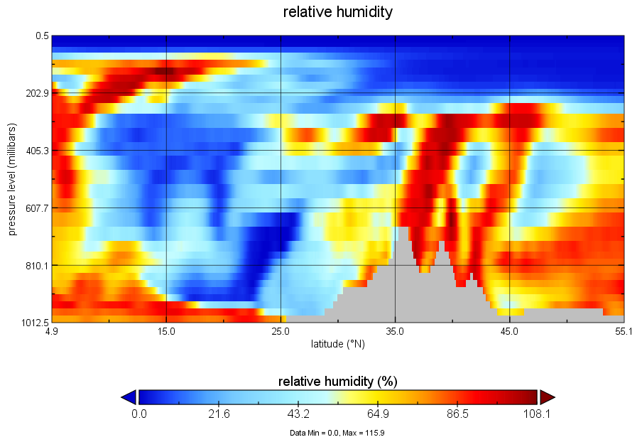

# ERA-Interim处理说明

[[toc]]  

## 概述  

本节简要的介绍对于[ERA-Interim](https://apps.ecmwf.int/datasets/data/interim-full-daily/levtype=pl/)的处理。

和之前的AMSR-E MLSE反演时采用的ERA-20C相比，Interim的分辨率较差，考虑反演时间，必须选择Interim

|                     | Interim             | 20C                     |
| ------------------- | ------------------- | ----------------------- |
| Spatial resolution  | 0.125<sup>o</sup>   | 0.125<sup>o</sup>       |
| Temporal resolution | **6 hr.**           | 3 hr.                   |
| Pressure levels     | 37                  | 37                      |
| Range               | Jan 1979 - Aug 2019 | Jan 1900 - **Dec 2010** |

使用的参数如下，

- 位势高度廓线 Geopotential = Z*g （高度\*重力加速度）；

- 湿度廓线 Relative Humidity（%）；
- 温度廓线 Temperature （K）；
- 气压分层 PMB（pressure in mb）；
- 地表温度场 LST（K）；
- 2m温度场 T2m (K) ；
- 地表压强 LSP （mb）

## 处理流程

本步骤对ERA的数据处理十分简单，除了提取参数之外，对处于地面以下（气压高于地表气压）的廓线层进行了缺测，如图3.1，对于湿度廓线的地形处理以后可以看到35度纬度处的山地。

  

<p style="text-align:center;color:darkred;">图 3.1 对ERA廓线进行地形处理</p>  

- 我们采用了全部37层数据提供大气廓线，进行水凝物廓线的制作，云高的定位和水汽微波辐射贡献的计算；  

- 去除底层地形以后剩下的廓线层数newL在反演时作为实际微波辐射透过的层数并最终输出到MLSE产品中；  

### - 文件夹内容  

```shell
- erai.process.ncl  #主要的处理程序，NCL语言编写
```

需要在脚本内部修改处理日期

```NCL
dl=(/31,29,31,30,31,30,31,31,30,31,30,31/)
yyyy="2016"   ;year
do  mm=1,12   ;month
do  dd = 1,dl(mm-1) ;day
```

```shell
$ncl era20c.preprocess.ncl 
```

对于批量处理这样比较麻烦，并且涉及到闰年，有兴趣可以改写成NCL带参形式运行和编写批量处理脚本，详细可以参考上一节。

## -输出

文件的输出是二进制形式，fortran读示例：

```fortran
        real*4  pmb(L),tkk(nlon,nlat,L,mt)	
        real*4  rhh(nlon,nlat,L,mt),zz(nlon,nlat,L,mt)
        real*4  late(nlat),lone(nlon) 		
        real*4  psurf(nlon,nlat,mt), skt(nlon,nlat,mt)
        real*4  t2mg(nlon,nlat,mt)  
        
        open(13,file= chfile,form="unformatted",access="sequential",ERR=401)	
	  
	         read(13) pmb
	         read(13) tkk
	         read(13) zz
	         read(13) rhh
	         read(13) psurf
	         read(13) skt
	         read(13) t2mg    		    
	   		 
		     read(13) late
             read(13) lone 
	         close(13)
```

----

&copy;Jiheng Hu 2019