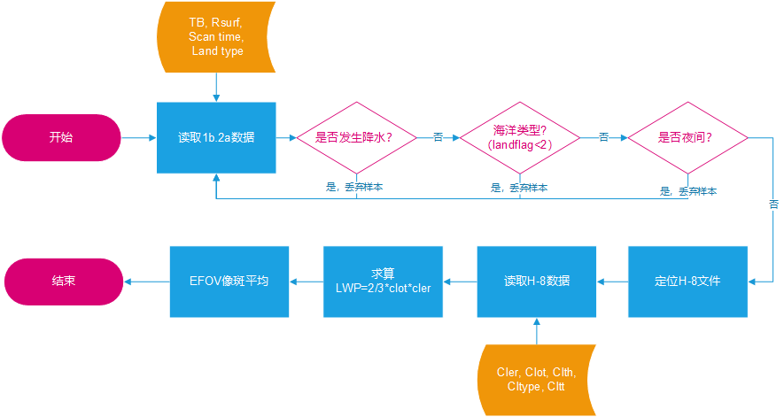
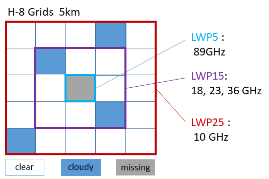
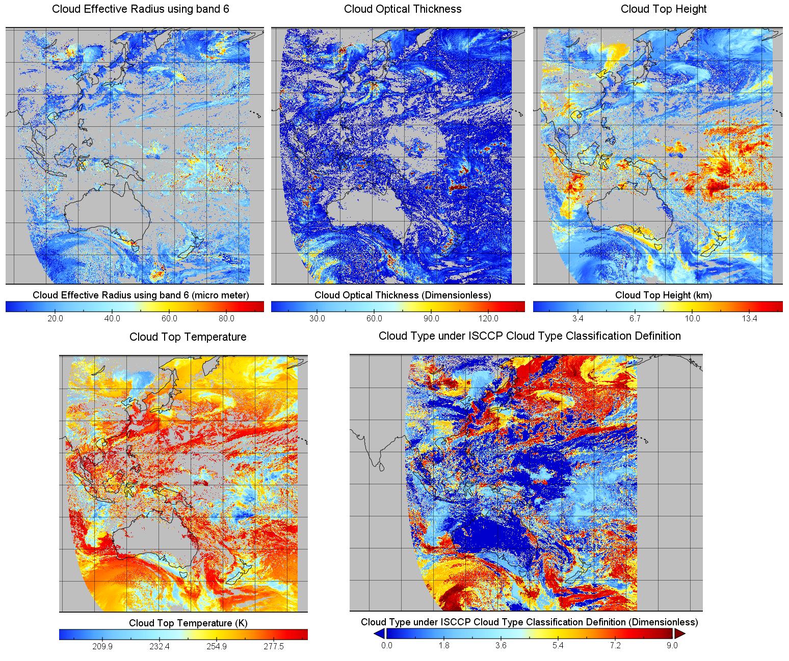
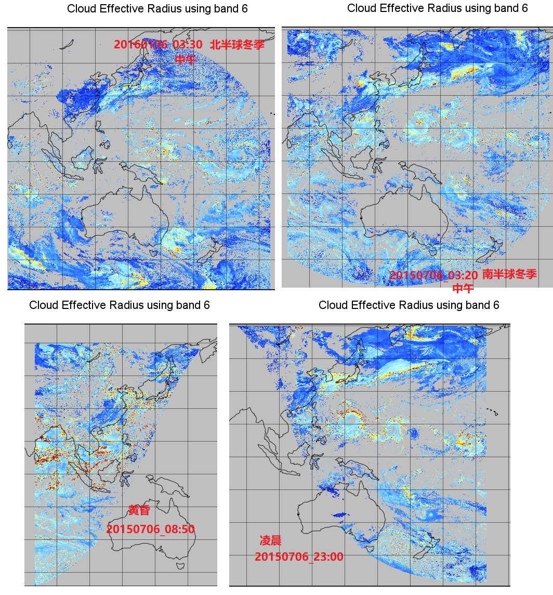

# Hamawari-8处理说明


[[toc]]  

本章节涉及到Hamawari-8卫星的处理方法，以及通过诸多条件来控制最终反演样本的质量和数目。在此之前，需要先对H-8卫星的数据有所了解：

## - Hamawari-8 数据简介

我们使用的数据是Hamawari-8号卫星的先进基线仪（ABI）探测结果反演得到的等经纬度间隔云参数产品，大致空间分布图见附录A。

- H-8的探测范围是：-60<sup>o</sup> N ~ 60<sup>o</sup> N ; 80<sup>o</sup> E ~ 200<sup>o</sup> E ;
- H-8的生命周期：Jul. 4，2015 ~ present；

---

## - 处理流程

项目所在位置为`demo/h8`，实际上是将上一节中融合好的1B2A数据匹配上云参数信息：

```shell
-rwxrwxrwx 1 hjh hjh     8852 Aug 20 15:16 quick.select.h8.fov.ncl* ##主程序NCL
-rwxrwxrwx 1 hjh hjh      320 Aug 20 15:16 batch.sh*                ##批量处理脚本
-rwxrwxrwx 1 hjh hjh     2901 Aug 20 15:16 print.stime.ncl*         ##绘制地方时
-rwxrwxrwx 1 hjh hjh 11429332 Aug 20 15:16 local.time.20160312.ps*  ##地方时分布
-rwxrwxrwx 1 hjh hjh      207 Aug 20 15:15 1b.2a.h8.20150704.txt*  ##输出示例
-rwxrwxrwx 1 hjh hjh  2533487 Aug 20 15:15 1b.2a.h8.20150705.txt*  ##输出示例
```

项目运行参考上一节：

- 单日处理方式

  ```shell
  $ncl year=2018 month=01 day=01  quick.select.h8.fov.ncl
  ```

- 批量处理方式

  ```shell
  $sh batch.sh 20170101 20170131 
  ```

因为输出对象是单个样本而非批量输出，本节未使用F77子程序做格式化输出，因此会慢一些，不过可以接受。使用NCL的`write_table`函数进行格式化输出。

---

### -流程

主程序中已经写得很明白嘞：

```
; 1.read in 1b.2a file, read tb record and scantime;
; 2.filter out night recod, missing value, out-domain pixel, rainyp pixels;
; 3.match h8 file and read cloud properties
; 4.caculate LWP=2/3*COT*Re*density_H2O
; 5.do average within EFOV for every frequencies/channels 
; 6.output 1b.2a.h8
```



<p style="text-align:center;color:darkred;">图 2.2 h8处理流程</p>

对每个样本频繁打开H-8文件效率极低，由于GPM观测时间上差别不大而且连续，可以先判断是否需要打开新H-8文件，效率提高4倍以上。

## - 影响样本质量的几个因素

- 降水样本的剔除，只要发生地面降水，样本就会舍弃，从本节开始，样本将不再具有降水信息；

- 夜间样本剔除：这一点不需要使用地方时进行限定，因为夜间H-8为缺测，在匹配云信息是会自动去除夜间的样本；

- 陆地类型：根据GMI2A的表面分类，大面积的陆地被定义成standing water,这一部分不能剔除，所以仅仅对海洋类型进行了剔除（landtype=1）；

- 有效半径Re和COT 缺测：只有同时存在Re和COT才能进行LWP的计算，所以云参数的反演成功率直接决定了有效样本的数量；

- 云类型cltype：

  ```
  0=Clear,10=Unknown, 255=Fill
  1=Ci,2=Cs,3=Deepconvection,4=Ac,5=As,6=Ns,7=Cu,8=Sc,9=St
   卷   卷层   深对流          高积  高层  雨层 淡积  层积  层       
  ```

  无法准确反映云的相态，目前全部视为液态水；

## - EFOV平均

由于GMI1B产品是没有经过resample的，所以，每个频率的EFOV不同，需要根据像斑大小进行平均。5个频率的分辨率和H-8的分辨率对比：

```
;; H8 resolution  5km
;; GPM FOV:
;    10GHz          18GHz        23GHz         36GHz         89GHz 
;  32.1x19.4      18.1x10.9     16x9.7       15.6x9.4       7.2x4.4  km*km
;assumed EFOV  equivalent area:
;  25x25          15x15         15x15         15x15          5x5     km*km  
;   5              3              3             3              1    grids
```

平均示意图如图2.3：



<p style="text-align:center;color:darkred;">图 2.3 EFOV平均示意图</p>

例如，对于云顶温度的平均操作，三种格点尺寸：

```
		cltt25:=sum(cltt(0:4,0:4))/25.;			 
		cltt15:=sum(cltt(1:3,1:3))/9.;	
		cltt5 := cltt(2,2);
```

### - 输出说明

比较长的输出语句，首先使用"w"关键字新建并添加header，再利用“a”关键字进行append，直接贴上来：

```NCL
 fnameout="1b.2a.h8."+year+sprinti("%0.2i",month)+sprinti("%0.2i",day)+".txt"	
 hlist=[/(/"ip iswath lon lat yyyymmdd scantime(UTC) localtime landflag  tbs0(K)  tbs1     
          tbs2 tbs3 tbs4 tbs5 tbs6 tbs7 tbs8 lwp5 lwp15(g/m2) lwp25 clth5 clth15(KM)
         clth25 cltt5(K) cltt15 cltt25 ctype5  ctype15   ctype25 "/)/]

write_table(fnameout, "w", hlist, "%s")

alist=[/ip,isw,lon,lat,yyyymmdd,stime,loct,land,tbs0,tbs1,tbs2,tbs3,tbs4,tbs5,tbs6,
       tbs7,tbs8,lwp5,lwp15,lwp25,clth5, clth15,clth25,cltt5,cltt15,cltt25,
       toint(ctype5),toint(ctype15),toint(ctype25)/]   

write_table(fnameout, "a", alist, "%6d %2d %16.5f %16.5f %6d %16.5f %16.5f %2d %16.5f
            %16.5f %16.5f %16.5f %16.5f %16.5f %16.5f %16.5f %16.5f %16.5f %16.5f  
            %16.5f %16.5f %16.5f %16.5f %16.5f %16.5f %16.5f  %3d %3d %3d")
```

输出示例

```
ip iswath lon lat yyyymmdd scantime(UTC) localtime landflag  tbs0(K) 
 tbs1 tbs2 tbs3 tbs4 tbs5 tbs6 tbs7 tbs8 lwp5 lwp15(g/m2) lwp25 clth5
 clth15(KM) clth25 cltt5(K) cltt15 cltt25 ctype5  ctype15   ctype25 
    58   5            125.53566            5.15992  20150705           9.04694   
	17.41599  13           172.58058            95.42616          205.63983       
	144.27826            245.11475           224.61485           170.16307       
	277.37769 		       261.14572       -999.90002         12.96238        
	7.63382       -999.90002          1.53644          0.95816       -999.90002    
    158.25555        114.66799    0  29  63
```


使用Fortran读取：

```fortran
      f1b2ah8='../h8/1b.2a.h8.'//year//month//day//'.txt'               
      open(12,file=f1b2ah8, status='old',ERR=402)
        read(12,*,end=1103)header

        read(12,*,end=1103)ip,isw,lon,lat,yyyymmdd,stime,loct,
     +         landflag,(tb(i),i=1,9),lwp5,lwp15,lwp25,clth5,
     +    clth15,clth25,cltt5,cltt15,cltt25,ctype,ctype,ctype
```


## -附录A.

- H-8诸参数空间分布示意图（UTC：00:30），右下方还处于日出前，没有可见光观测。



- 观测结果随太阳高度和季节有所残缺，如下图，是几种典型的情况，导致图像不同部位发生缺测。

  

&copy;Jiheng Hu 2019