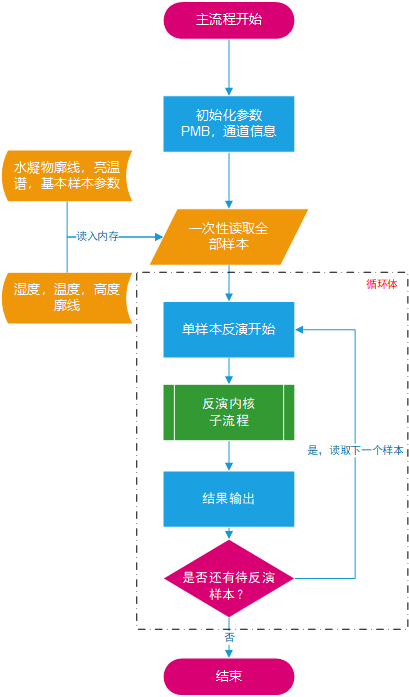
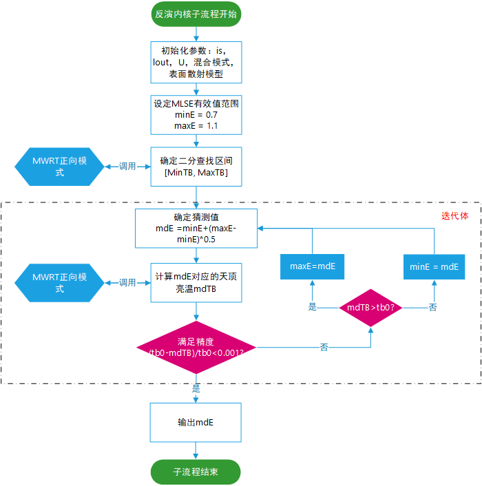
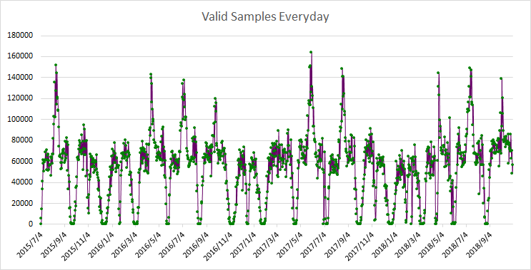
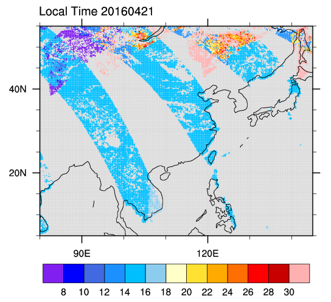
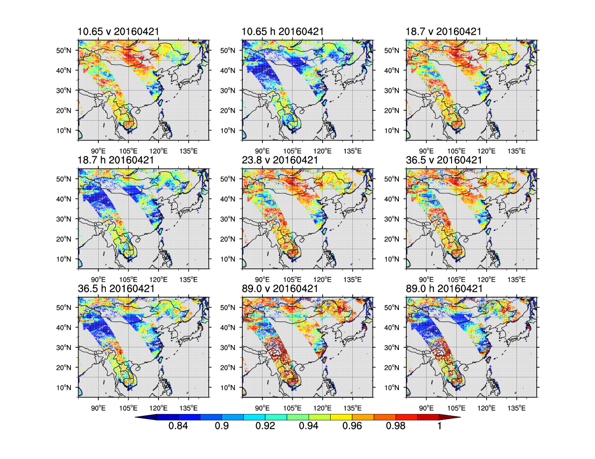

# 反演部分说明

[[toc]]  

## 概述  
到目前为止，反演所需要的数据已经准备完毕。本节主要对最终的反演操作加以说明。

项目的目录是retrieve，结构如下

```shell
-rwxrwxrwx 1 hjh hjh   6833 Aug 23 11:18 run.f*     ##主程序，包含数据的读入，反演和输出三部分
-rwxrwxrwx 1 hjh hjh     96 Aug 23 11:18 bash.sh*    ##引用mwrt库对主程序进行编译
-rwxrwxrwx 1 hjh hjh    315 Aug 23 11:18 batch.sh*   ##批量处理脚本
-rwxrwxrwx 1 hjh hjh   3159 Aug 23 11:18 core-iteration.f*  ##反演子程序
drwxrwxrwx 1 hjh hjh   4096 Aug 23 11:19 data/       ## 输出文件夹
-rwxrwxrwx 1 hjh hjh 120403 Aug 23 11:18 produce.exe*  ##编译以后的可执行文件
```

运行如下方式见本节附录，基本上与上一版本相同。

---

## - 流程

- 反演主流程的任务是读取全部样本并进行必要的初始化操作。一次性将所有样本读入内存的数据中，反演时对数组进行循环反演，反演结果存储在内存中，等到所有样本反演结束再一次性输出到文件中。相比于从文件中逐行读取样本，边读边写边反演的做法来说，会有很大的内存开销，但是可以最大程度的避免由于频繁读写带来的进程阻塞（CPU和内存完全可以满足高速运算要求，I/O是制约进程的主要原因，因为涉及到磁盘硬件运行），将绝大部分的任务交给CPU进行连续的运算，只在开始和结束的时候进行读写。



<p style="text-align:center;color:darkred;">图 5.1 反演主流程图</p>

- 反演内核采用的是二分查找的思想进行持续迭代，知道满足0.001（TB相对误差）的精度要求。和第二版的反演相比，本版本的初始猜测区间为[0.7, 1.1]，落在区间外的样本取最近的端点值，第二版的范围是[0.75, 1.05]，虽然同样是无意义的值，但是会影响到产品的统计特征。本版本的迭代分割点是0.5，而上一版本的分割点是0.618黄金分割，有研究表明后者迭代效率要更高。



<p style="text-align:center;color:darkred;">图 5.2 反演内核流程图</p>

---

## - 数据说明

```fortran
        write(15,100)ip,isw,newl,yyyymmdd,landflag,lon,lat,
     +     (MLSEs(i),i=1,9),(tb(i),i=1,9),tw1,lst,t2m,stime,loct             
100     format(5(2x,I8),25F16.4)	
```

```
ip       样本在单条轨道上的序号
isw      样本所在轨道在当天所有轨道中的序号
newl     有效大气廓线层数
yyyymmdd 样本扫描年月日，可能和文件名中的日期不一致（跨天的轨道）
landflag 样本点的表面类型：
         1 : Ocean, 2 : Sea ice, 3-7 : Decreasing vegetation, 
         8-11 :decreasing snow cover, 12: standing water, 
         13 : land/ocean or water coast, 14 : sea-ice edge, 15 = Land/Ice edge

lon      样本点经度
lat      样本点纬度
MLSEs(9) 反演得到的9通道MLSE
tb(9)    卫星天顶亮温（K）
tw1      样本点处的云液态水积分（g/m2）
lst      地表温度（k）
t2m      2m气温（K）
stime    样本扫描UTC时间（hr）
loct     样本扫描地方时间（hr）
```

示例：

```gfortran
882       5         36        20150705     13        125.6229   6.1268       0.8516    0.7891    0.9125    0.8984    0.9063      0.9156     0.9031     0.8875       0.8750      258.0973  240.7902  279.1485  276.1769    283.5199   281.3865   279.0714     285.8336    285.2910  230.7015  300.2792  300.8109    9.0516     17.4265
```

你会发现很多MLSE值是一样的，不要奇怪，根据我们设定的0.001的精度，0.7和1.1之间的迭代次数十分有限，如果亮温差异在3k以内左右，得到的 MLSE很可能是一样的。并且整个MLSE 的取值是离散的，因为在有限次迭代以后，mlse取到的值都是一定的。

---

## - 读取

- 利用fortran读取

```fortran 77
!! F77(fixed form) code
       integer   ip,isw,newl,i,j,yyyymmdd,landflag
       real      lon,lat
       real      tw1,lst,t2m,stime,loct
       real      MLSEs(9),tb(9)

1100    read(12,*,end=1101) ip,isw,newl,yyyymmdd,landflag,lon,lat,
     +     (MLSEs(i),i=1,9),(tb(i),i=1,9),tw1,lst,t2m,stime,loct
```

- 利用NCL读取

```ncl
    filein="./mlse.cn.gmi.h8.erai.001.20150705.txt"      
     nrows = numAsciiRow(filein); 读取行数
     ncols = numAsciiCol(filein); 读取列数

     array = asciiread(filein,(/nrows,ncols/),"float") ;  读取数据阵
     ;分配变量
     ip        = floattoint(array(:,0)); 
     isw       = floattoint(array(:,1)); 
     newl      = floattoint(array(:,2));  
     yyyymmdd  = floattoint(array(:,3)); 
     landflag  = floattoint(array(:,4));
     
     flon  = array(:,5);   
     flat  = array(:,6);  
     
     mlse  = array(:,7:15);   
     tb    = array(:,16:24); 
     tw1   = array(:,25); 
     lst   = array(:,26); 
     t2m   = array(:,27);      
     stime = array(:,28); 
     loct  = array(:,29); 
     
```


- 样本数统计，和collocation结果完全一致




## - 附录

### - 反演文件的运行

- 首先进行编译，需要用到MWRT的库函数，`bash.sh`内容如下:

  ```shell
  f95 run.f /home/hjh/mwsim/src/rdcmd.c -L /home/hjh/mwsim/lib/ -lrad -lmwrt -llap -o produce.exe
  ```

  运行脚本：

  ```shell
  $sh bash.sh
  ```

  产生可执行文件`produce.exe`

   `/home/hjh/mwsim/src/rdcmd.c -L /home/hjh/mwsim/lib/-lrad -lmwrt -llap` 是连接到MWRT的安装目录的，需要根据自己安装情况修改。

- 单个日期处理（如2004年1月1日)

  ```shell
  $./produce.exe 20150705
   20150705
   read done 20150705
   write done 20150705
    sample :        5680  time :    1073.1208    
  ```

  运行结果：data文件夹下出现`mlse.cn.gmi.h8.erai.001.20150705.txt`，任务完成。

  这个过程运行较慢，大概几十分钟到5个小时。

- 批量日期处理（如20150802~20150803）

  使用`batch.sh`脚本

  ```shell
  $sh batch.sh 20150802 20150803
  ```

  运行结果：执行日志会出现在同目录下：`20150802-20150803.log`

  data文件夹下出现

  `mlse.cn.gmi.h8.erai.001.20150802.txt`

  `mlse.cn.gmi.h8.erai.001.20150803.txt`

  对于批量来说，建议一个月分段跑一个，处理一个月在7天左右（0.001精度要求下）。所以建议你后台运行：

  ```shell
  $nohup sh batch.sh 20150801 20150831 > log.201508 &
  $jobs -l
  [1]+ 15669 Running          nohup sh batch.sh 20150801 20150831 > log.201508 &
  ##注意检查日志，运行是否正常。
  ```

------

### - 结果展示

```shell
-rwxrwxrwx 1 hjh hjh   1857 Aug 23 17:20 plot.local.time.ncl*  ### 绘制地方时
-rwxrwxrwx 1 hjh hjh   5102 Aug 23 17:20 plot.mlse.ncl*      ### 绘制MLSE空间分布
```

- 地方时



- MLSE谱



&copy;Jiheng Hu 2019